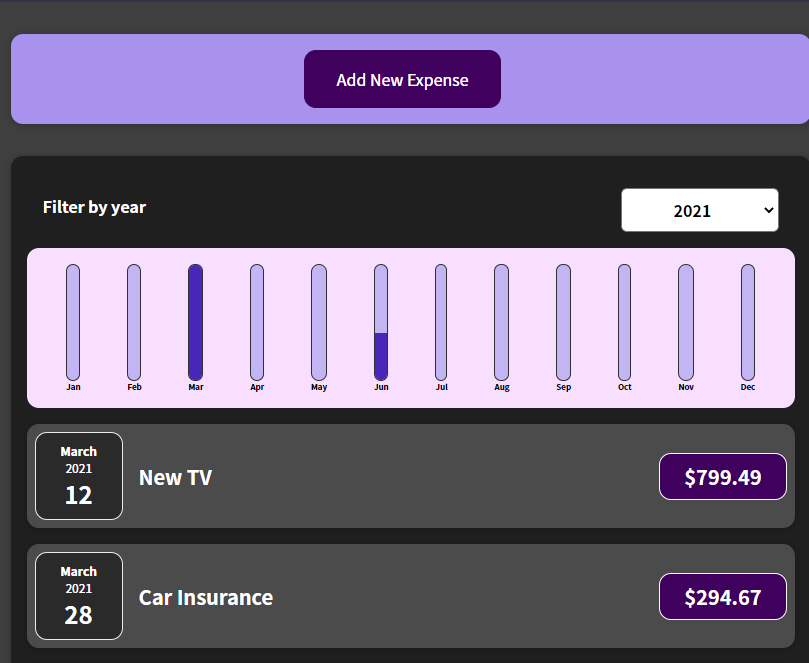

# Expense-tracker-app

### Scope of functionalities

- Add expenses using title, amount and date field
- Display expenses filtered by year also display all expenses 
- A chart to compare expenses in one selected year
- Split the funtionalities into several components ~ Chart, Expenses, NewExpense, UI

